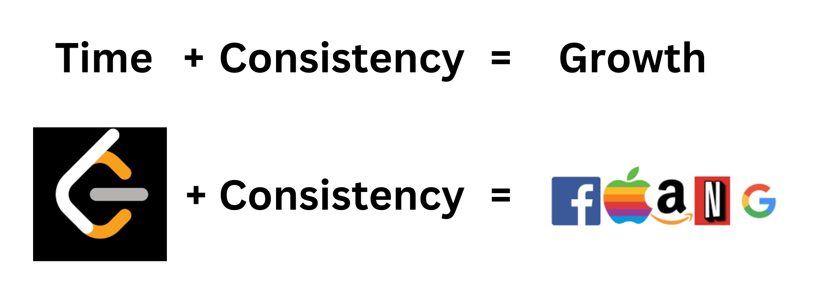

<p align="center">
  
</p>

<h1 align="center">LeetCode Diaries</h1>

<p align="center">
  <strong>"A LeetCode a Day Keeps Unemployment Away"</strong>
</p>

<p align="center">
  
  
  
</p>

---

## 📊 LeetCode Stats

<p align="center">
  
</p>

---

## 🎯 Progress Overview

| Platform | Problems | Patterns Covered | Progress |
|----------|----------|------------------|----------|
| [Design Gurus](./design-gurus/) | 37 | 5/20 | ████████░░ 40% |
| [Structy](./structy/) | 3 | 1/9 | █░░░░░░░░░ 10% |
| NeetCode | - | - | Coming Soon |
| TUF+ | - | - | Coming Soon |
| ByteByteGo | - | - | Coming Soon |

---

## 🧠 Patterns Mastered

```
✅ Sliding Window          ████████████ 9 problems
✅ Two Pointers            ████████████ 12 problems  
✅ Fast & Slow Pointers    ███████████░ 7 problems
✅ Warmup                  ████████████ 8 problems
🔄 Tree BFS               █░░░░░░░░░░░ 1 problem
🔄 Graphs                 ██░░░░░░░░░░ 3 problems
⬜ Dynamic Programming    ░░░░░░░░░░░░ 0 problems
⬜ Binary Search          ░░░░░░░░░░░░ 0 problems
⬜ Backtracking           ░░░░░░░░░░░░ 0 problems
```

---

## 🛠️ Tech Stack

<p align="center">
  
  
  
</p>

---

## 📁 Repository Structure

```
leetcode-diaries/
├── design-gurus/              # Grokking the Coding Interview
│   ├── sliding-window/
│   │   └── 0209-minimum-size-subarray-sum/
│   │       ├── solution.cpp
│   │       └── solution.py    # (optional)
│   ├── two-pointers/
│   ├── fast-slow-pointers/
│   └── ...
├── structy/                   # Structy.net problems
│   └── graph-1/
├── templates/                 # Solution templates
│   ├── solution.cpp
│   ├── solution.py
│   └── README.md
└── README.md
```

---

## ✨ What Makes This Repo Different

| Feature | Description |
|---------|-------------|
| **Multiple Approaches** | Each problem includes brute force → optimal solutions |
| **Detailed Analysis** | Time & space complexity for every approach |
| **Intuition First** | Explains the "why" before the "how" |
| **Multi-Language Ready** | Folder structure supports C++, Python, Java, etc. |
| **Platform Organized** | Track progress across paid platforms |

---

## 🚀 Quick Start

1. **Browse by Platform:** Navigate to [`design-gurus/`](./design-gurus/) or [`structy/`](./structy/)
2. **Browse by Pattern:** Check the platform README for pattern-based navigation
3. **Use Templates:** Copy from [`templates/`](./templates/) when starting new problems

---

## 📈 Skills Demonstrated

- **Data Structures:** Arrays, Linked Lists, Trees, Graphs, Hash Maps, Heaps
- **Algorithms:** Sorting, Searching, Dynamic Programming, Backtracking
- **Patterns:** Sliding Window, Two Pointers, Fast & Slow Pointers, BFS/DFS
- **Problem Solving:** Multiple approaches with incremental optimization
- **Code Quality:** Clean, documented, and testable solutions

---

## 🔗 Connect

<p align="center">
  <a href="https://leetcode.com/u/abdullahalkheshen/">
    
  </a>
  <a href="https://github.com/abdullahalkheshen">
    
  </a>
</p>

---

<p align="center">
  <i>⭐ Star this repo if you find it helpful!</i>
</p>
